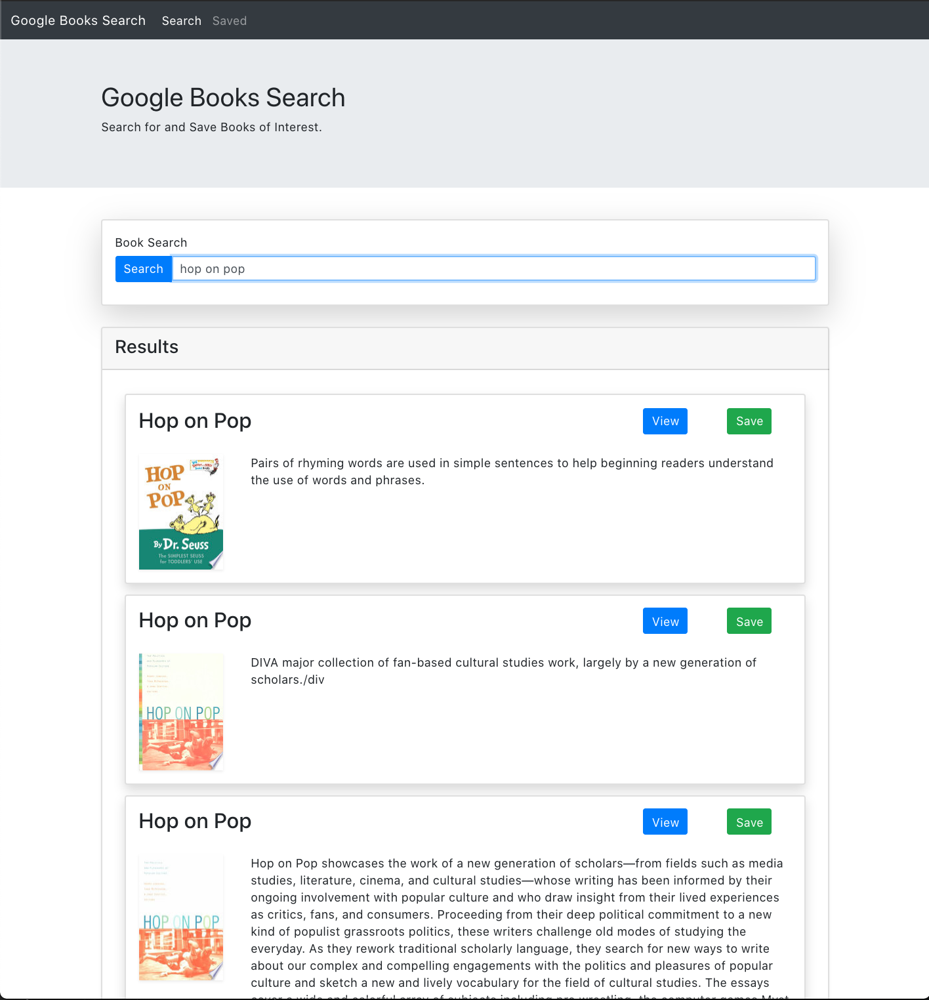
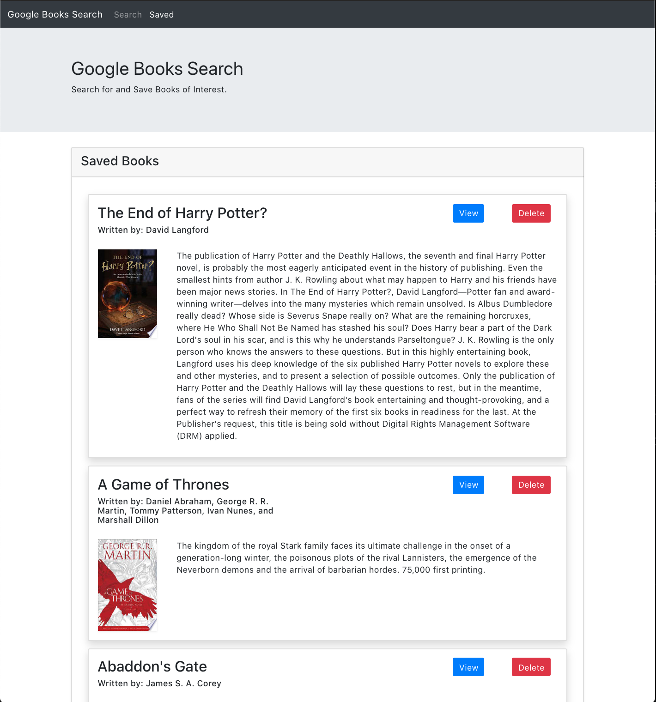

# google-books-search
[](http://unlicense.org/)

## Description

A single page React application that allows searching for and saving books using the Google Books API

## Table of Contents

* [Installation](#installation)

* [Usage](#usage)

* [License](#license)

* [Contributing](#contributing)

* [Screenshots](#screenshots)

* [Links](#links)

* [Questions](#questions)

## Installation

To install the necessary dependencies, run the following command:

```
npm install
```

## Usage

Once you run `npm install` you can run `npm start` to test the page locally.

## License

This project is licensed under the None license.

## Contributing

I am no longer maintaining this application, but I will review PRs.

## Screenshots





## Links

[GitHub Repository](https://github.com/zackapotamus/google-books-search)

[Heroku Hosted Page](https://react-gbs-app.herokuapp.com/)

## Questions


If you have any questions about the repo, open an issue or contact [zackapotamus](https://api.github.com/users/zackapotamus) at [zack.hayden@gmail.com](mailto:zack.hayden@gmail.com).

